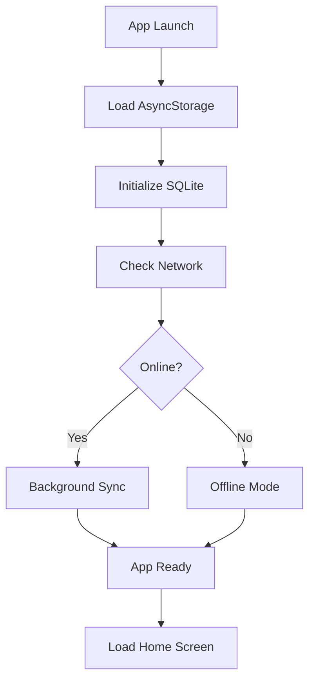
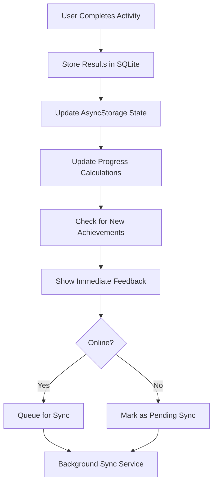

# BuddyBot - API & Data Flow Architecture

## 🏗️ **Storage Architecture Overview**

### **Hybrid Local-First + Cloud Sync Design**

BuddyBot uses a **local-first architecture** with **cloud synchronization** to ensure:
- ✅ Full offline functionality for autism users
- ✅ Multi-device data consistency  
- ✅ Privacy-compliant cloud backup
- ✅ No interruptions during therapeutic activities

---

## 📊 **Data Storage Layers**

### **Layer 1: Local SQLite Database (Primary)**

**Purpose**: Core data storage, offline-first, immediate access

```sql
-- User Profile with sync metadata
CREATE TABLE user_profile (
  id TEXT PRIMARY KEY,           -- UUID for cloud sync
  user_id TEXT,                  -- Cloud user account ID
  created_at DATETIME,
  updated_at DATETIME,
  synced_at DATETIME,            -- Last successful sync
  sync_status TEXT DEFAULT 'pending', -- 'synced', 'pending', 'conflict'
  avatar_config TEXT,            -- JSON: customization data
  accessibility_preferences TEXT -- JSON: user accessibility settings
);

-- Activity Sessions with sync support
CREATE TABLE activity_sessions (
  id TEXT PRIMARY KEY,           -- UUID
  user_id TEXT,
  activity_type TEXT,            -- 'social_flashcards', 'breathing', etc.
  completed_at DATETIME,
  score INTEGER,
  time_spent INTEGER,            -- Seconds
  difficulty_level INTEGER,      -- 1-5 scale
  emotional_state_before TEXT,   -- Pre-activity mood
  emotional_state_after TEXT,    -- Post-activity mood
  device_id TEXT,               -- Which device created this
  created_at DATETIME,
  updated_at DATETIME,
  synced_at DATETIME,
  sync_status TEXT DEFAULT 'pending'
);

-- Skill Progress Tracking
CREATE TABLE skill_progress (
  id TEXT PRIMARY KEY,
  user_id TEXT,
  skill_category TEXT,           -- 'social_skills', 'emotions', 'communication', 'self_regulation'
  progress_percentage REAL,      -- 0.0 to 100.0
  milestone_reached TEXT,        -- Latest milestone achieved
  last_updated DATETIME,
  assessment_data TEXT,          -- JSON: detailed progress metrics
  device_id TEXT,
  created_at DATETIME,
  updated_at DATETIME,
  synced_at DATETIME,
  sync_status TEXT DEFAULT 'pending'
);

-- AI Chat History (Encrypted for cloud)
CREATE TABLE chat_messages (
  id TEXT PRIMARY KEY,
  user_id TEXT,
  message_text TEXT,            -- Encrypted before cloud sync
  is_bot_message BOOLEAN,
  timestamp DATETIME,
  mood_context TEXT,            -- User's mood during conversation
  activity_context TEXT,        -- Related activity if applicable
  conversation_session_id TEXT, -- Group related messages
  device_id TEXT,
  created_at DATETIME,
  synced_at DATETIME,
  sync_status TEXT DEFAULT 'pending'
);

-- Achievement System
CREATE TABLE achievements (
  id TEXT PRIMARY KEY,
  user_id TEXT,
  badge_type TEXT,              -- 'first_activity', 'week_streak', etc.
  badge_category TEXT,          -- 'participation', 'progress', 'consistency'
  earned_at DATETIME,
  activity_trigger TEXT,        -- What activity triggered this badge
  device_id TEXT,
  synced_at DATETIME,
  sync_status TEXT DEFAULT 'pending'
);

-- Detailed Activity Results
CREATE TABLE flashcard_results (
  id TEXT PRIMARY KEY,
  session_id TEXT,              -- Links to activity_sessions
  emotion_type TEXT,            -- 'happy', 'sad', 'angry', etc.
  emotion_shown TEXT,           -- Image/scenario shown
  user_response TEXT,           -- User's answer
  correct BOOLEAN,
  response_time INTEGER,        -- Milliseconds
  confidence_level INTEGER,     -- 1-5 if user provides
  completed_at DATETIME,
  device_id TEXT,
  synced_at DATETIME,
  sync_status TEXT DEFAULT 'pending'
);

-- Breathing Exercise Data
CREATE TABLE breathing_sessions (
  id TEXT PRIMARY KEY,
  session_id TEXT,              -- Links to activity_sessions
  breathing_pattern TEXT,       -- 'box', 'triangle', 'custom'
  duration_seconds INTEGER,
  stress_level_before INTEGER,  -- 1-10 scale
  stress_level_after INTEGER,   -- 1-10 scale
  completed_successfully BOOLEAN,
  device_id TEXT,
  synced_at DATETIME,
  sync_status TEXT DEFAULT 'pending'
);
```

### **Layer 2: AsyncStorage (Quick Access)**

**Purpose**: Immediate access data, user preferences, session state

```javascript
const STORAGE_KEYS = {
  // Authentication & Sync
  USER_ID: 'user_id',
  AUTH_TOKEN: 'auth_token',
  DEVICE_ID: 'device_id',
  LAST_SYNC_TIMESTAMP: 'last_sync_timestamp',
  SYNC_ENABLED: 'sync_enabled',
  OFFLINE_CHANGES_COUNT: 'offline_changes_count',
  
  // User Preferences (Synced to Cloud)
  ACCESSIBILITY_SETTINGS: 'accessibility_settings',
  /*
  {
    fontSize: 'large',
    highContrast: true,
    reducedMotion: false,
    voiceEnabled: true,
    hapticFeedback: true,
    screenReaderEnabled: false
  }
  */
  
  THEME_PREFERENCES: 'theme_preferences',
  /*
  {
    primaryColor: '#87CEEB',
    darkMode: false,
    customColors: false
  }
  */
  
  AVATAR_CONFIG: 'avatar_config',
  /*
  {
    bodyType: 'robot',
    color: '#87CEEB',
    accessories: ['hat', 'glasses'],
    name: 'Buddy',
    expressions: ['happy', 'encouraging']
  }
  */
  
  // App State
  ONBOARDING_COMPLETED: 'onboarding_completed',
  SELECTED_GOALS: 'selected_goals', // ['social_skills', 'emotions']
  CURRENT_SESSION: 'current_session',
  /*
  {
    lastActiveScreen: 'home',
    botGreetingShown: true,
    dailyCheckInCompleted: false,
    currentStreak: 5
  }
  */
  
  // Quick Access Data
  SUGGESTED_ACTIVITIES: 'suggested_activities',
  RECENT_ACHIEVEMENTS: 'recent_achievements',
  LAST_COMPLETED_ACTIVITY: 'last_completed_activity'
};
```

### **Layer 3: Cloud Storage (Backup & Sync)**

**Purpose**: Multi-device sync, data backup, parental dashboard

```sql
-- Cloud Database Schema

-- User Accounts (COPPA Compliant)
CREATE TABLE users (
  id UUID PRIMARY KEY,
  created_at TIMESTAMP,
  guardian_email TEXT,          -- Required for users under 13
  age_group TEXT,               -- '6-12', '13-18', '19-24'
  subscription_type TEXT,       -- 'free', 'premium'
  data_retention_days INTEGER DEFAULT 365,
  parental_consent BOOLEAN DEFAULT false,
  consent_date TIMESTAMP
);

-- Device Management
CREATE TABLE user_devices (
  id UUID PRIMARY KEY,
  user_id UUID REFERENCES users(id),
  device_id TEXT UNIQUE,
  device_name TEXT,
  platform TEXT,               -- 'ios', 'android'
  app_version TEXT,
  last_sync TIMESTAMP,
  active BOOLEAN DEFAULT true
);

-- Replicated Local Tables (Cloud Versions)
CREATE TABLE activity_sessions_cloud (
  -- Same structure as local table
  id UUID PRIMARY KEY,
  user_id UUID REFERENCES users(id),
  -- ... all local fields ...
  cloud_created_at TIMESTAMP,
  last_modified_device TEXT,
  conflict_resolution TEXT,     -- For multi-device conflicts
  data_hash TEXT               -- For integrity verification
);

-- Sync Metadata
CREATE TABLE sync_operations (
  id UUID PRIMARY KEY,
  user_id UUID REFERENCES users(id),
  device_id TEXT,
  operation_type TEXT,         -- 'push', 'pull', 'conflict_resolution'
  table_name TEXT,
  record_count INTEGER,
  started_at TIMESTAMP,
  completed_at TIMESTAMP,
  status TEXT,                 -- 'success', 'failed', 'partial'
  error_details TEXT
);
```

---

## 🔄 **Data Flow & Synchronization**

### **1. App Startup Flow**



### **2. Activity Completion Flow**



### **3. Cloud Sync Strategy**

```javascript
// Sync Service Implementation
class CloudSyncManager {
  
  // Sync Priority Levels
  SYNC_PRIORITIES = {
    HIGH: ['skill_progress', 'user_profile', 'achievements'],
    MEDIUM: ['activity_sessions', 'chat_messages'],
    LOW: ['flashcard_results', 'breathing_sessions']
  };
  
  async performSync() {
    try {
      // 1. Authenticate and refresh token
      await this.authenticateUser();
      
      // 2. Pull latest changes from cloud (high priority first)
      const cloudChanges = await this.pullFromCloud();
      await this.mergeCloudChanges(cloudChanges);
      
      // 3. Push local changes (handle conflicts)
      const localChanges = await this.getUnsyncedLocalChanges();
      const conflicts = await this.pushToCloud(localChanges);
      
      // 4. Resolve any conflicts
      if (conflicts.length > 0) {
        await this.resolveConflicts(conflicts);
      }
      
      // 5. Update sync timestamps
      await this.updateSyncStatus();
      
    } catch (error) {
      console.log('Sync failed, queuing for retry:', error);
      await this.queueSyncRetry();
    }
  }
  
  // Conflict Resolution for Autism App
  async resolveConflicts(conflicts) {
    for (const conflict of conflicts) {
      const resolution = this.getConflictResolution(conflict);
      
      switch (conflict.table) {
        case 'activity_sessions':
          // Keep all sessions, merge by timestamp
          await this.mergeActivitySessions(conflict);
          break;
          
        case 'skill_progress':
          // Use highest progress value
          await this.useHighestProgress(conflict);
          break;
          
        case 'user_profile':
          // Merge non-conflicting fields, prefer latest update
          await this.mergeUserProfile(conflict);
          break;
          
        default:
          // Default: prefer most recent timestamp
          await this.useLatestTimestamp(conflict);
      }
    }
  }
}
```

---

## 🔐 **Privacy & Security Architecture**

### **Data Classification & Encryption**

```javascript
const DATA_SECURITY_LEVELS = {
  
  // Level 1: Public (No encryption needed)
  PUBLIC: {
    tables: ['app_metadata'],
    encryption: false,
    cloudStorage: true,
    parentalAccess: true
  },
  
  // Level 2: Personal (Standard encryption)
  PERSONAL: {
    tables: ['user_profile', 'achievements', 'activity_sessions'],
    encryption: 'AES-256',
    cloudStorage: true,
    parentalAccess: true  // For minors
  },
  
  // Level 3: Sensitive (High encryption)
  SENSITIVE: {
    tables: ['chat_messages', 'emotional_data'],
    encryption: 'AES-256-GCM',
    cloudStorage: true,
    parentalAccess: false, // Private to user
    dataRetention: 90     // Days
  },
  
  // Level 4: Device Only (No cloud)
  DEVICE_ONLY: {
    tables: ['temp_session_data', 'cache'],
    encryption: false,
    cloudStorage: false,
    dataRetention: 1      // Days
  }
};
```

### **Authentication Flow for Autism Users**

```javascript
// Simplified, accessible authentication
const AUTH_METHODS = {
  
  // Primary: Simple PIN (autism-friendly)
  DEVICE_PIN: {
    type: 'numeric',
    length: 4,
    attempts: 5,
    biometric: true,      // Optional fingerprint
    visualFeedback: true, // Large buttons, clear feedback
    description: 'Simple 4-digit code'
  },
  
  // Secondary: Guardian email (for account recovery)
  GUARDIAN_EMAIL: {
    type: 'email',
    purpose: 'recovery_only',
    required: true,       // For users under 13
    parentalConsent: true
  },
  
  // Accessibility: Visual pattern (for non-verbal users)
  VISUAL_PATTERN: {
    type: 'pattern',
    grid: '3x3',
    colors: ['blue', 'green', 'yellow'],
    shapes: ['circle', 'square', 'triangle'],
    hapticFeedback: true
  }
};
```

---

## 📡 **API Endpoints**

### **Cloud API Design**

```javascript
const API_ENDPOINTS = {
  
  // Authentication
  REGISTER: 'POST /auth/register',
  LOGIN: 'POST /auth/login',
  REFRESH_TOKEN: 'POST /auth/refresh',
  LOGOUT: 'POST /auth/logout',
  
  // Data Synchronization
  SYNC_PULL: 'GET /sync/pull/:timestamp',
  SYNC_PUSH: 'POST /sync/push',
  SYNC_STATUS: 'GET /sync/status',
  RESOLVE_CONFLICTS: 'POST /sync/resolve',
  
  // User Management
  GET_PROFILE: 'GET /users/profile',
  UPDATE_PROFILE: 'PUT /users/profile',
  DELETE_ACCOUNT: 'DELETE /users/account',
  
  // Data Export (GDPR Compliance)
  EXPORT_DATA: 'GET /data/export',
  DATA_PORTABILITY: 'GET /data/download',
  
  // Parental Features (for minors)
  PARENTAL_DASHBOARD: 'GET /parent/dashboard',
  PROGRESS_REPORT: 'GET /parent/progress',
  CONSENT_MANAGEMENT: 'POST /parent/consent',
  
  // Device Management
  REGISTER_DEVICE: 'POST /devices/register',
  LIST_DEVICES: 'GET /devices',
  REVOKE_DEVICE: 'DELETE /devices/:deviceId'
};
```

---

## 🎯 **Offline-First Benefits for Autism Users**

### **1. Predictable Experience**
- App functions identically online/offline
- No loading states during activities
- Consistent performance regardless of connection

### **2. Reduced Anxiety**
- No network dependency for core features
- Activities never interrupted by connectivity issues
- Progress always saved locally first

### **3. Privacy by Design**
- Sensitive data encrypted on device
- Minimal cloud data transmission
- User controls what syncs to cloud

### **4. Multi-Device Flexibility**
- Seamless transition between devices
- Progress syncs automatically when online
- Consistent personalization everywhere

This architecture ensures BuddyBot provides a reliable, secure, and autism-friendly experience while leveraging modern cloud capabilities for data backup and multi-device support. 